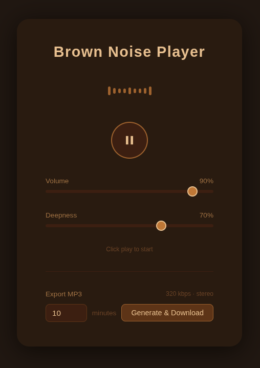

# Brown Noise Player

A single-page web app that generates and plays brown noise continuously in the browser. No server, no dependencies to install, just open `index.html` and it works.

## What it does

- Generates brown noise in real time using the Web Audio API. The signal is produced by layering four independent low-pass integrators at different rates, giving a rich, deep texture with no looping or restarts.
- Volume and Deepness controls. Volume adjusts loudness. Deepness shifts the spectral character of the noise: lower values produce a brighter, higher-pitched sound; higher values produce a darker, deeper rumble.
- Settings are saved in `localStorage` and restored on the next visit.
- MP3 export. Set a duration in minutes, click Generate, and the app renders the audio offline and downloads a 320 kbps stereo MP3. Generation can be cancelled at any time.

## How to use

Open `index.html` in any modern browser. No build step or internet connection required (except for the first load, which fetches the lamejs encoder from a CDN for the MP3 export feature).
